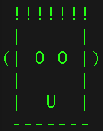

# Lesson Plan \>
**Lesson ID:** PROG1700 2-1  
**Faculty Member:** Sean Morrow  
**Subject:** [course name]  

**Content:**
- topic 1
- topic 2
- topic 3

**Prerequisites:**
- list of resources and URLs

**Announcements:**
- list of reminders and announcements

## Instructional Procedures:

### Major topic title from content above
- example of nested point forms
- point form lesson note
- point form lesson note
	- point form lesson note
		- point form lesson note
			- point form lesson note
			- point form lesson note

### formatting
- use **bold** for bold
- use *italics* for italics
- use ~~strikethrough~~ for strikethrough
- use `code` for inline code

### code snippets
- code can be inserted inline with backticks and syntax highlighting
	- add following code:
	```js
	window.alert("Hello World!")
	```
- another example:
	```python
	vowelLocation = name.find("e")
	print("Where is the e in my name? Character position " + str(vowelLocation))
	```

### sectioning content
- often I use blank lines to separate content in a lesson plan
- this is not doable using markdown
- instead, divide up the content using a horizontal rule
- for example:
	- demoing something to students
	- do this to your code
	- talk about the code
	---
	- do something else to your code
	- talk about the code
	---
	- do something else to your code
	- talk about the code

### images
- images can be inserted using the following syntax:
	- ``
	- example:  
	

### other tricks
- emoticons :joy:
- link example and emoticons reference: https://gist.github.com/rxaviers/7360908
- to highlight content for later modifying while authoring lesson plans use mark tag of HTML
	- example: <mark>highlighted text</mark>
- escape reserved characters with \
- two blank spaces at the end of content will force a carriage return

### CHALLENGE : [challenge title]
- challenge description

## Materials and Equipment
- resource 1 (PROVIDED)
- resource 2